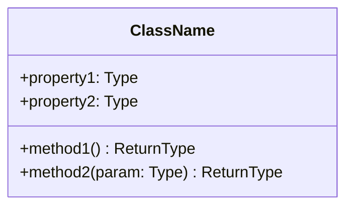
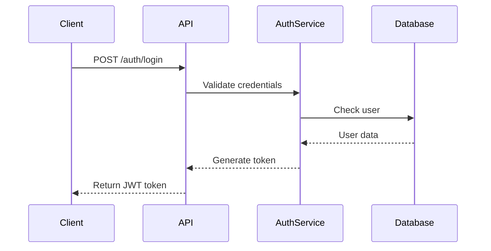
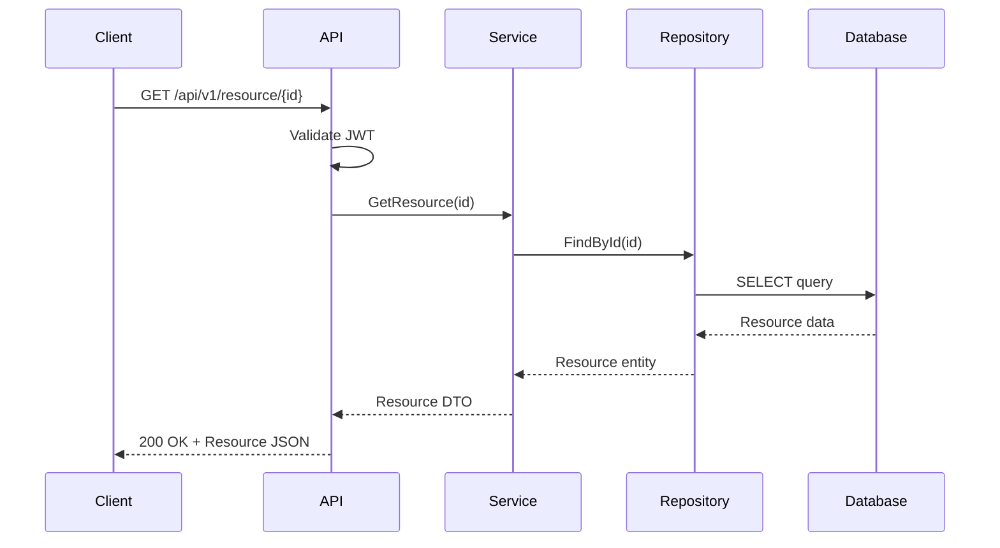

# C# Project Analyzer - Complete Implementation

## requirements.txt
```
llama-index==0.10.37
lancedb==0.6.13
tree-sitter==0.21.3
tree-sitter-languages==1.10.2
ollama==0.2.1
pydantic==2.7.1
tqdm==4.66.4
networkx==3.3
matplotlib==3.8.4
python-dotenv==1.0.1
fastapi==0.111.0
uvicorn==0.29.0
```

## config.py
```python
import os
from pathlib import Path

# Model Configuration
MODEL_NAME = "qwen2.5-coder:7b-instruct"
EMBEDDING_MODEL = "nomic-embed-text"
CONTEXT_WINDOW = 32768
MAX_TOKENS = 4096
TEMPERATURE = 0.1

# Paths
BASE_DIR = Path(__file__).parent
DATA_DIR = BASE_DIR / "data"
CACHE_DIR = BASE_DIR / "cache"
VECTOR_DB_PATH = DATA_DIR / "lancedb"

# Chunking Configuration
CHUNK_SIZE = 2000
CHUNK_OVERLAP = 200
MAX_CHUNKS_PER_QUERY = 10

# Create directories
DATA_DIR.mkdir(exist_ok=True)
CACHE_DIR.mkdir(exist_ok=True)

# Performance Settings
BATCH_SIZE = 50
MAX_WORKERS = 4
```

## main.py
```python
#!/usr/bin/env python3
import argparse
import sys
from pathlib import Path
from src.code_parser import CSharpParser
from src.vector_store import VectorStore
from src.rag_pipeline import RAGPipeline
from src.llm_interface import LLMInterface
from src.diagram_generator import DiagramGenerator
from src.project_generator import ProjectGenerator
import logging

logging.basicConfig(level=logging.INFO, format='%(asctime)s - %(levelname)s - %(message)s')
logger = logging.getLogger(__name__)

class CSharpProjectAnalyzer:
    def __init__(self, project_path: str):
        self.project_path = Path(project_path)
        if not self.project_path.exists():
            raise ValueError(f"Project path {project_path} does not exist")
        
        logger.info("Initializing components...")
        self.parser = CSharpParser()
        self.vector_store = VectorStore()
        self.llm = LLMInterface()
        self.rag = RAGPipeline(self.vector_store, self.llm)
        self.diagram_gen = DiagramGenerator(self.rag)
        self.project_gen = ProjectGenerator(self.rag)
        
    def index_project(self, force_reindex=False):
        """Index the C# project into vector store"""
        logger.info(f"Indexing project: {self.project_path}")
        
        if not force_reindex and self.vector_store.is_indexed(str(self.project_path)):
            logger.info("Project already indexed. Use --force-reindex to reindex.")
            return
        
        # Parse all C# files
        cs_files = list(self.project_path.rglob("*.cs"))
        logger.info(f"Found {len(cs_files)} C# files")
        
        documents = []
        for file in cs_files:
            try:
                doc = self.parser.parse_file(file)
                if doc:
                    documents.append(doc)
            except Exception as e:
                logger.error(f"Error parsing {file}: {e}")
        
        # Index documents
        self.vector_store.index_documents(documents, str(self.project_path))
        logger.info("Indexing complete!")
    
    def query(self, question: str):
        """Query the indexed project"""
        logger.info(f"Query: {question}")
        response = self.rag.query(question, str(self.project_path))
        return response
    
    def generate_lld(self, component: str = None):
        """Generate Low Level Design document"""
        logger.info(f"Generating LLD for: {component or 'entire project'}")
        return self.diagram_gen.generate_lld(str(self.project_path), component)
    
    def generate_api_workflow(self):
        """Generate API workflow diagram"""
        logger.info("Generating API workflow diagram")
        return self.diagram_gen.generate_api_workflow(str(self.project_path))
    
    def generate_project(self, lld_path: str, output_path: str):
        """Generate new C# project from LLD"""
        logger.info(f"Generating project from LLD: {lld_path}")
        self.project_gen.generate_from_lld(
            lld_path, 
            output_path, 
            str(self.project_path)
        )

def main():
    parser = argparse.ArgumentParser(description='C# Project Analyzer')
    parser.add_argument('project_path', help='Path to C# project')
    parser.add_argument('--index', action='store_true', help='Index the project')
    parser.add_argument('--force-reindex', action='store_true', help='Force reindexing')
    parser.add_argument('--query', help='Query the project')
    parser.add_argument('--generate-lld', nargs='?', const='', help='Generate LLD for component')
    parser.add_argument('--generate-api-workflow', action='store_true', help='Generate API workflow')
    parser.add_argument('--generate-project', nargs=2, metavar=('LLD_PATH', 'OUTPUT_PATH'), 
                       help='Generate project from LLD')
    
    args = parser.parse_args()
    
    try:
        analyzer = CSharpProjectAnalyzer(args.project_path)
        
        if args.index or args.force_reindex:
            analyzer.index_project(args.force_reindex)
        
        if args.query:
            response = analyzer.query(args.query)
            print("\nResponse:")
            print(response)
        
        if args.generate_lld is not None:
            lld = analyzer.generate_lld(args.generate_lld if args.generate_lld else None)
            print("\nGenerated LLD:")
            print(lld)
        
        if args.generate_api_workflow:
            workflow = analyzer.generate_api_workflow()
            print("\nGenerated API Workflow:")
            print(workflow)
        
        if args.generate_project:
            analyzer.generate_project(args.generate_project[0], args.generate_project[1])
            print(f"\nProject generated at: {args.generate_project[1]}")
            
    except Exception as e:
        logger.error(f"Error: {e}")
        sys.exit(1)

if __name__ == "__main__":
    main()
```

## src/__init__.py
```python
# Empty file to make src a package
```

## src/code_parser.py
```python
import tree_sitter_languages as tsl
from pathlib import Path
import hashlib
import json
from typing import List, Dict, Any
import logging

logger = logging.getLogger(__name__)

class CSharpParser:
    def __init__(self):
        self.parser = tsl.get_parser("c_sharp")
        
    def parse_file(self, file_path: Path) -> Dict[str, Any]:
        """Parse a C# file and extract structured information"""
        try:
            content = file_path.read_text(encoding='utf-8')
            tree = self.parser.parse(content.encode())
            
            # Extract metadata
            metadata = {
                'file_path': str(file_path),
                'file_name': file_path.name,
                'content': content,
                'hash': hashlib.md5(content.encode()).hexdigest(),
                'classes': [],
                'methods': [],
                'interfaces': [],
                'namespaces': [],
                'usings': []
            }
            
            # Parse tree to extract structures
            self._extract_structures(tree.root_node, content, metadata)
            
            # Create document with chunks
            return self._create_document(metadata)
            
        except Exception as e:
            logger.error(f"Error parsing {file_path}: {e}")
            return None
    
    def _extract_structures(self, node, source_code: str, metadata: Dict):
        """Recursively extract code structures"""
        if node.type == 'namespace_declaration':
            namespace = source_code[node.start_byte:node.end_byte]
            metadata['namespaces'].append({
                'name': self._get_namespace_name(node, source_code),
                'content': namespace,
                'start_line': node.start_point[0],
                'end_line': node.end_point[0]
            })
        
        elif node.type == 'class_declaration':
            class_name = self._get_class_name(node, source_code)
            metadata['classes'].append({
                'name': class_name,
                'content': source_code[node.start_byte:node.end_byte],
                'start_line': node.start_point[0],
                'end_line': node.end_point[0],
                'methods': self._extract_methods(node, source_code)
            })
        
        elif node.type == 'interface_declaration':
            interface_name = self._get_interface_name(node, source_code)
            metadata['interfaces'].append({
                'name': interface_name,
                'content': source_code[node.start_byte:node.end_byte],
                'start_line': node.start_point[0],
                'end_line': node.end_point[0]
            })
        
        elif node.type == 'using_directive':
            using = source_code[node.start_byte:node.end_byte]
            metadata['usings'].append(using)
        
        # Recurse through children
        for child in node.children:
            self._extract_structures(child, source_code, metadata)
    
    def _extract_methods(self, class_node, source_code: str) -> List[Dict]:
        """Extract methods from a class node"""
        methods = []
        for child in class_node.children:
            if child.type == 'method_declaration':
                method_name = self._get_method_name(child, source_code)
                methods.append({
                    'name': method_name,
                    'signature': self._get_method_signature(child, source_code),
                    'content': source_code[child.start_byte:child.end_byte],
                    'start_line': child.start_point[0],
                    'end_line': child.end_point[0]
                })
        return methods
    
    def _get_namespace_name(self, node, source_code: str) -> str:
        """Extract namespace name from node"""
        for child in node.children:
            if child.type == 'identifier' or child.type == 'qualified_name':
                return source_code[child.start_byte:child.end_byte]
        return "Unknown"
    
    def _get_class_name(self, node, source_code: str) -> str:
        """Extract class name from node"""
        for child in node.children:
            if child.type == 'identifier':
                return source_code[child.start_byte:child.end_byte]
        return "Unknown"
    
    def _get_interface_name(self, node, source_code: str) -> str:
        """Extract interface name from node"""
        for child in node.children:
            if child.type == 'identifier':
                return source_code[child.start_byte:child.end_byte]
        return "Unknown"
    
    def _get_method_name(self, node, source_code: str) -> str:
        """Extract method name from node"""
        for child in node.children:
            if child.type == 'identifier':
                return source_code[child.start_byte:child.end_byte]
        return "Unknown"
    
    def _get_method_signature(self, node, source_code: str) -> str:
        """Extract method signature"""
        # Find the parameter list
        for child in node.children:
            if child.type == 'parameter_list':
                end_byte = child.end_byte
                return source_code[node.start_byte:end_byte]
        return source_code[node.start_byte:node.start_byte + 100]  # Fallback
    
    def _create_document(self, metadata: Dict) -> Dict:
        """Create document with intelligent chunks"""
        chunks = []
        
        # Create file-level summary chunk
        summary = f"File: {metadata['file_name']}\n"
        summary += f"Namespaces: {', '.join([ns['name'] for ns in metadata['namespaces']])}\n"
        summary += f"Classes: {', '.join([cls['name'] for cls in metadata['classes']])}\n"
        summary += f"Interfaces: {', '.join([intf['name'] for intf in metadata['interfaces']])}\n"
        
        chunks.append({
            'type': 'file_summary',
            'content': summary,
            'metadata': {
                'file_path': metadata['file_path'],
                'chunk_type': 'summary'
            }
        })
        
        # Create chunks for each class
        for cls in metadata['classes']:
            # Class-level chunk
            class_chunk = f"Class: {cls['name']}\n"
            class_chunk += f"File: {metadata['file_name']}\n"
            class_chunk += f"Methods: {', '.join([m['name'] for m in cls['methods']])}\n\n"
            class_chunk += cls['content'][:1000]  # First 1000 chars
            
            chunks.append({
                'type': 'class',
                'content': class_chunk,
                'metadata': {
                    'file_path': metadata['file_path'],
                    'class_name': cls['name'],
                    'chunk_type': 'class'
                }
            })
            
            # Method-level chunks for large methods
            for method in cls['methods']:
                if len(method['content']) > 500:
                    method_chunk = f"Method: {method['name']}\n"
                    method_chunk += f"Class: {cls['name']}\n"
                    method_chunk += f"File: {metadata['file_name']}\n\n"
                    method_chunk += method['content']
                    
                    chunks.append({
                        'type': 'method',
                        'content': method_chunk,
                        'metadata': {
                            'file_path': metadata['file_path'],
                            'class_name': cls['name'],
                            'method_name': method['name'],
                            'chunk_type': 'method'
                        }
                    })
        
        return {
            'file_path': metadata['file_path'],
            'chunks': chunks,
            'metadata': metadata
        }
```

## src/embeddings.py
```python
import ollama
from typing import List, Dict
import numpy as np
from tqdm import tqdm
import logging

logger = logging.getLogger(__name__)

class EmbeddingGenerator:
    def __init__(self, model_name: str = "nomic-embed-text"):
        self.model_name = model_name
        self._ensure_model()
    
    def _ensure_model(self):
        """Ensure embedding model is available"""
        try:
            ollama.show(self.model_name)
        except:
            logger.info(f"Pulling embedding model: {self.model_name}")
            ollama.pull(self.model_name)
    
    def generate_embedding(self, text: str) -> List[float]:
        """Generate embedding for a single text"""
        try:
            response = ollama.embeddings(
                model=self.model_name,
                prompt=text
            )
            return response['embedding']
        except Exception as e:
            logger.error(f"Error generating embedding: {e}")
            return None
    
    def generate_embeddings_batch(self, texts: List[str], batch_size: int = 10) -> List[List[float]]:
        """Generate embeddings for multiple texts in batches"""
        embeddings = []
        
        for i in tqdm(range(0, len(texts), batch_size), desc="Generating embeddings"):
            batch = texts[i:i + batch_size]
            batch_embeddings = []
            
            for text in batch:
                embedding = self.generate_embedding(text)
                if embedding:
                    batch_embeddings.append(embedding)
                else:
                    # Use zero vector as fallback
                    batch_embeddings.append([0.0] * 768)
            
            embeddings.extend(batch_embeddings)
        
        return embeddings
```

## src/vector_store.py
```python
import lancedb
from pathlib import Path
import json
from typing import List, Dict, Any
import logging
from src.embeddings import EmbeddingGenerator
import config

logger = logging.getLogger(__name__)

class VectorStore:
    def __init__(self):
        self.db = lancedb.connect(str(config.VECTOR_DB_PATH))
        self.embedding_gen = EmbeddingGenerator()
        
    def is_indexed(self, project_path: str) -> bool:
        """Check if a project is already indexed"""
        try:
            table_name = self._get_table_name(project_path)
            self.db.open_table(table_name)
            return True
        except:
            return False
    
    def index_documents(self, documents: List[Dict], project_path: str):
        """Index documents into vector store"""
        table_name = self._get_table_name(project_path)
        
        # Prepare data for indexing
        records = []
        all_chunks = []
        
        for doc in documents:
            for chunk in doc['chunks']:
                all_chunks.append(chunk)
        
        logger.info(f"Indexing {len(all_chunks)} chunks...")
        
        # Generate embeddings in batches
        texts = [chunk['content'] for chunk in all_chunks]
        embeddings = self.embedding_gen.generate_embeddings_batch(texts)
        
        # Create records
        for i, (chunk, embedding) in enumerate(zip(all_chunks, embeddings)):
            record = {
                'id': i,
                'content': chunk['content'],
                'embedding': embedding,
                'type': chunk['type'],
                'metadata': json.dumps(chunk['metadata'])
            }
            records.append(record)
        
        # Create or replace table
        logger.info(f"Creating table: {table_name}")
        if self.is_indexed(project_path):
            self.db.drop_table(table_name)
        
        table = self.db.create_table(table_name, records)
        logger.info(f"Indexed {len(records)} chunks successfully")
    
    def search(self, query: str, project_path: str, top_k: int = 10) -> List[Dict]:
        """Search for relevant chunks"""
        table_name = self._get_table_name(project_path)
        
        try:
            table = self.db.open_table(table_name)
            
            # Generate query embedding
            query_embedding = self.embedding_gen.generate_embedding(query)
            if not query_embedding:
                logger.error("Failed to generate query embedding")
                return []
            
            # Search
            results = table.search(query_embedding).limit(top_k).to_list()
            
            # Parse results
            parsed_results = []
            for result in results:
                parsed_results.append({
                    'content': result['content'],
                    'type': result['type'],
                    'metadata': json.loads(result['metadata']),
                    'score': result.get('_distance', 0)
                })
            
            return parsed_results
            
        except Exception as e:
            logger.error(f"Error searching: {e}")
            return []
    
    def _get_table_name(self, project_path: str) -> str:
        """Generate table name from project path"""
        # Simple hash of the path
        import hashlib
        return f"project_{hashlib.md5(project_path.encode()).hexdigest()[:8]}"
```

## src/llm_interface.py
```python
import ollama
import config
import logging
from typing import Dict, Any

logger = logging.getLogger(__name__)

class LLMInterface:
    def __init__(self):
        self.model_name = config.MODEL_NAME
        self._ensure_model()
    
    def _ensure_model(self):
        """Ensure LLM model is available"""
        try:
            ollama.show(self.model_name)
            logger.info(f"Model {self.model_name} is available")
        except:
            logger.info(f"Pulling model: {self.model_name}")
            ollama.pull(self.model_name)
    
    def generate(self, prompt: str, system_prompt: str = None, temperature: float = None) -> str:
        """Generate response from LLM"""
        try:
            messages = []
            
            if system_prompt:
                messages.append({
                    'role': 'system',
                    'content': system_prompt
                })
            
            messages.append({
                'role': 'user',
                'content': prompt
            })
            
            response = ollama.chat(
                model=self.model_name,
                messages=messages,
                options={
                    'temperature': temperature or config.TEMPERATURE,
                    'num_predict': config.MAX_TOKENS,
                }
            )
            
            return response['message']['content']
            
        except Exception as e:
            logger.error(f"Error generating response: {e}")
            return f"Error: {str(e)}"
    
    def generate_streaming(self, prompt: str, system_prompt: str = None):
        """Generate streaming response from LLM"""
        try:
            messages = []
            
            if system_prompt:
                messages.append({
                    'role': 'system',
                    'content': system_prompt
                })
            
            messages.append({
                'role': 'user',
                'content': prompt
            })
            
            stream = ollama.chat(
                model=self.model_name,
                messages=messages,
                stream=True,
                options={
                    'temperature': config.TEMPERATURE,
                    'num_predict': config.MAX_TOKENS,
                }
            )
            
            for chunk in stream:
                yield chunk['message']['content']
                
        except Exception as e:
            logger.error(f"Error generating streaming response: {e}")
            yield f"Error: {str(e)}"
```

## src/rag_pipeline.py
```python
from typing import List, Dict, Any
import logging

logger = logging.getLogger(__name__)

class RAGPipeline:
    def __init__(self, vector_store, llm_interface):
        self.vector_store = vector_store
        self.llm = llm_interface
    
    def query(self, question: str, project_path: str) -> str:
        """Process a query using RAG"""
        # Search for relevant chunks
        relevant_chunks = self.vector_store.search(question, project_path, top_k=10)
        
        if not relevant_chunks:
            return "No relevant information found in the codebase."
        
        # Build context
        context = self._build_context(relevant_chunks)
        
        # Generate prompt
        prompt = self._build_prompt(question, context)
        
        # Get response
        system_prompt = """You are a C# code analysis expert. You have deep knowledge of C# programming, 
        design patterns, and software architecture. Answer questions based on the provided codebase context.
        Be specific and reference actual code when relevant."""
        
        response = self.llm.generate(prompt, system_prompt)
        return response
    
    def query_with_context(self, question: str, project_path: str, additional_context: str) -> str:
        """Query with additional context"""
        relevant_chunks = self.vector_store.search(question, project_path, top_k=8)
        
        context = self._build_context(relevant_chunks)
        context = f"{additional_context}\n\n{context}"
        
        prompt = self._build_prompt(question, context)
        
        system_prompt = """You are a C# code analysis and generation expert. Use the provided context 
        to answer questions and generate code that follows the existing patterns and conventions."""
        
        response = self.llm.generate(prompt, system_prompt)
        return response
    
    def _build_context(self, chunks: List[Dict]) -> str:
        """Build context from retrieved chunks"""
        context_parts = []
        
        # Group by type for better organization
        by_type = {}
        for chunk in chunks:
            chunk_type = chunk['type']
            if chunk_type not in by_type:
                by_type[chunk_type] = []
            by_type[chunk_type].append(chunk)
        
        # Build context in order of importance
        for chunk_type in ['file_summary', 'class', 'method']:
            if chunk_type in by_type:
                context_parts.append(f"\n[{chunk_type.upper()} CONTEXT]")
                for chunk in by_type[chunk_type][:3]:  # Limit per type
                    metadata = chunk['metadata']
                    context_parts.append(f"\nFile: {metadata.get('file_path', 'Unknown')}")
                    if 'class_name' in metadata:
                        context_parts.append(f"Class: {metadata['class_name']}")
                    if 'method_name' in metadata:
                        context_parts.append(f"Method: {metadata['method_name']}")
                    context_parts.append(f"\n{chunk['content']}\n")
        
        return "\n".join(context_parts)
    
    def _build_prompt(self, question: str, context: str) -> str:
        """Build the final prompt"""
        return f"""Based on the following C# codebase context, answer the question.

CODEBASE CONTEXT:
{context}

QUESTION: {question}

Please provide a detailed and accurate answer based on the code context provided. If you reference specific code, 
mention the file and class/method names."""
```

## src/diagram_generator.py
```python
import logging
from typing import Optional

logger = logging.getLogger(__name__)

class DiagramGenerator:
    def __init__(self, rag_pipeline):
        self.rag = rag_pipeline
    
    def generate_lld(self, project_path: str, component: Optional[str] = None) -> str:
        """Generate Low Level Design document"""
        if component:
            question = f"""Generate a detailed Low Level Design (LLD) document for the {component} component.
            Include:
            1. Component Overview
            2. Class Diagrams (in Mermaid format)
            3. Sequence Diagrams for key operations
            4. Data Models
            5. Interface Definitions
            6. Dependencies and Interactions
            7. Error Handling Strategy
            8. Performance Considerations"""
        else:
            question = """Generate a comprehensive Low Level Design (LLD) document for the entire project.
            Include:
            1. System Architecture Overview
            2. Component Breakdown
            3. Class Diagrams (in Mermaid format) for major components
            4. Data Flow Diagrams
            5. Database Schema (if applicable)
            6. API Specifications
            7. Security Architecture
            8. Deployment Architecture"""
        
        response = self.rag.query(question, project_path)
        
        # Format as markdown document
        lld = f"""# Low Level Design Document
{'## Component: ' + component if component else '## System Design'}

Generated from codebase analysis.

---

{response}

---

## Appendix

### Mermaid Diagram Rendering
To view the diagrams, use any Mermaid-compatible viewer or paste into:
- https://mermaid.live/
- VS Code with Mermaid extension
- Any markdown viewer with Mermaid support
"""
        
        return lld
    
    def generate_api_workflow(self, project_path: str) -> str:
        """Generate API workflow diagram"""
        question = """Analyze all API endpoints and controllers in the project and generate:
        1. Complete API endpoint inventory
        2. Request/Response flow diagrams (in Mermaid format)
        3. Authentication and authorization flow
        4. API workflow sequence diagrams for major use cases
        5. Error handling patterns
        6. Integration points with external services
        
        Focus on creating clear Mermaid diagrams that show the flow of API requests through the system."""
        
        response = self.rag.query(question, project_path)
        
        workflow = f"""# API Workflow Documentation

Generated from codebase analysis.

---

{response}

---

## API Testing Guide

Based on the above workflows, here are curl examples for testing:

```bash
# Add your API testing examples here
```
"""
        
        return workflow
    
    def generate_class_diagram(self, project_path: str, namespace: str = None) -> str:
        """Generate class diagram for specific namespace or entire project"""
        if namespace:
            question = f"Generate a detailed Mermaid class diagram for the {namespace} namespace showing all classes, interfaces, properties, methods, and relationships."
        else:
            question = "Generate a comprehensive Mermaid class diagram showing the main classes, interfaces, and their relationships across the project."
        
        response = self.rag.query(question, project_path)
        return response


## src/project_generator.py
```python
import logging
from pathlib import Path
import os
import json

logger = logging.getLogger(__name__)

class ProjectGenerator:
    def __init__(self, rag_pipeline):
        self.rag = rag_pipeline
    
    def generate_from_lld(self, lld_path: str, output_path: str, reference_project: str):
        """Generate a new C# project based on LLD and reference project patterns"""
        # Read LLD
        lld_content = Path(lld_path).read_text()
        
        # Create output directory
        output_dir = Path(output_path)
        output_dir.mkdir(parents=True, exist_ok=True)
        
        # Analyze LLD and extract components
        components = self._extract_components_from_lld(lld_content, reference_project)
        
        # Generate project structure
        self._generate_project_structure(output_dir, components)
        
        # Generate code for each component
        for component in components:
            self._generate_component_code(component, output_dir, reference_project)
        
        # Generate project files
        self._generate_project_files(output_dir, components, reference_project)
        
        logger.info(f"Project generated successfully at: {output_path}")
    
    def _extract_components_from_lld(self, lld_content: str, reference_project: str) -> list:
        """Extract components from LLD"""
        question = f"""Based on this LLD document, extract all components that need to be generated:
        
{lld_content}

For each component, provide:
1. Component name
2. Type (namespace/class/interface/enum)
3. File path structure
4. Dependencies
5. Key methods and properties

Format the response as a structured list."""
        
        response = self.rag.query_with_context(question, reference_project, lld_content)
        
        # Parse response to extract components
        # In real implementation, this would parse the structured response
        components = self._parse_component_list(response)
        return components
    
    def _generate_project_structure(self, output_dir: Path, components: list):
        """Create directory structure for the project"""
        directories = set()
        
        for component in components:
            file_path = component.get('file_path', '')
            if '/' in file_path:
                directory = output_dir / Path(file_path).parent
                directories.add(directory)
        
        for directory in directories:
            directory.mkdir(parents=True, exist_ok=True)
    
    def _generate_component_code(self, component: dict, output_dir: Path, reference_project: str):
        """Generate code for a single component"""
        component_type = component.get('type', 'class')
        component_name = component.get('name', 'Unknown')
        
        prompt = f"""Generate complete C# code for the following component based on the existing project patterns:

Component Type: {component_type}
Component Name: {component_name}
Dependencies: {component.get('dependencies', [])}
Description: {component.get('description', '')}

Requirements:
1. Follow the coding patterns and conventions from the reference project
2. Include all necessary using statements
3. Implement all specified methods and properties
4. Add appropriate XML documentation
5. Follow the same error handling patterns
6. Use the same naming conventions

Generate production-ready code."""
        
        code = self.rag.query_with_context(prompt, reference_project, str(component))
        
        # Clean and format the code
        code = self._clean_generated_code(code)
        
        # Write to file
        file_path = output_dir / component.get('file_path', f"{component_name}.cs")
        file_path.write_text(code)
        logger.info(f"Generated: {file_path}")
    
    def _generate_project_files(self, output_dir: Path, components: list, reference_project: str):
        """Generate .csproj and other project files"""
        # Generate .csproj
        question = """Based on the reference project, what should be included in the .csproj file?
        Extract: target framework, package references, project references, and other configurations."""
        
        project_info = self.rag.query(question, reference_project)
        
        csproj_content = self._generate_csproj(project_info, components)
        (output_dir / "Generated.csproj").write_text(csproj_content)
        
        # Generate solution file
        sln_content = self._generate_solution_file("Generated", output_dir)
        (output_dir.parent / "Generated.sln").write_text(sln_content)
    
    def _parse_component_list(self, response: str) -> list:
        """Parse component list from LLM response"""
        # This is a simplified parser - in production, use more robust parsing
        components = []
        
        # Example parsing logic
        lines = response.split('\n')
        current_component = {}
        
        for line in lines:
            if line.strip().startswith('Component:'):
                if current_component:
                    components.append(current_component)
                current_component = {'name': line.split(':', 1)[1].strip()}
            elif line.strip().startswith('Type:'):
                current_component['type'] = line.split(':', 1)[1].strip()
            elif line.strip().startswith('Path:'):
                current_component['file_path'] = line.split(':', 1)[1].strip()
            elif line.strip().startswith('Dependencies:'):
                deps = line.split(':', 1)[1].strip()
                current_component['dependencies'] = [d.strip() for d in deps.split(',')]
        
        if current_component:
            components.append(current_component)
        
        return components
    
    def _clean_generated_code(self, code: str) -> str:
        """Clean and format generated code"""
        # Remove markdown code blocks if present
        if '```csharp' in code:
            code = code.split('```csharp')[1].split('```')[0]
        elif '```' in code:
            code = code.split('```')[1].split('```')[0]
        
        # Ensure proper line endings
        code = code.strip()
        
        return code
    
    def _generate_csproj(self, project_info: str, components: list) -> str:
        """Generate .csproj file content"""
        return """<Project Sdk="Microsoft.NET.Sdk">
  <PropertyGroup>
    <OutputType>Library</OutputType>
    <TargetFramework>net8.0</TargetFramework>
    <Nullable>enable</Nullable>
    <ImplicitUsings>enable</ImplicitUsings>
  </PropertyGroup>

  <ItemGroup>
    <!-- Add package references based on analysis -->
  </ItemGroup>
</Project>"""
    
    def _generate_solution_file(self, project_name: str, project_dir: Path) -> str:
        """Generate .sln file content"""
        import uuid
        project_guid = str(uuid.uuid4()).upper()
        
        return f"""Microsoft Visual Studio Solution File, Format Version 12.00
# Visual Studio Version 17
VisualStudioVersion = 17.0.31903.59
MinimumVisualStudioVersion = 10.0.40219.1
Project("{{FAE04EC0-301F-11D3-BF4B-00C04F79EFBC}}") = "{project_name}", "{project_dir.name}\\{project_name}.csproj", "{{{project_guid}}}"
EndProject
Global
    GlobalSection(SolutionConfigurationPlatforms) = preSolution
        Debug|Any CPU = Debug|Any CPU
        Release|Any CPU = Release|Any CPU
    EndGlobalSection
    GlobalSection(ProjectConfigurationPlatforms) = postSolution
        {{{project_guid}}}.Debug|Any CPU.ActiveCfg = Debug|Any CPU
        {{{project_guid}}}.Debug|Any CPU.Build.0 = Debug|Any CPU
        {{{project_guid}}}.Release|Any CPU.ActiveCfg = Release|Any CPU
        {{{project_guid}}}.Release|Any CPU.Build.0 = Release|Any CPU
    EndGlobalSection
EndGlobal"""


## templates/lld_template.md
```markdown
# Low Level Design Template

## 1. Component Overview
- **Name**: [Component Name]
- **Purpose**: [Brief description]
- **Responsibilities**: [List key responsibilities]

## 2. Architecture

### 2.1 Class Diagram


### 2.2 Component Dependencies
- External Dependencies:
  - [Library/Package Name]
- Internal Dependencies:
  - [Other Component Names]

## 3. Data Models

### 3.1 Entity Definitions
```csharp
public class EntityName
{
    public int Id { get; set; }
    public string Property { get; set; }
}
```

## 4. Interface Definitions

### 4.1 Public Interfaces
```csharp
public interface IServiceName
{
    Task<Result> MethodName(Parameter param);
}
```

## 5. Implementation Details

### 5.1 Key Algorithms
[Describe any complex algorithms]

### 5.2 Design Patterns Used
- [Pattern Name]: [How it's applied]

## 6. Error Handling

### 6.1 Exception Types
- `CustomException`: [When thrown]

### 6.2 Error Recovery Strategies
[Describe strategies]

## 7. Performance Considerations

### 7.1 Caching Strategy
[If applicable]

### 7.2 Optimization Techniques
[List techniques]

## 8. Security Considerations

### 8.1 Authentication
[Describe approach]

### 8.2 Authorization
[Describe approach]

## 9. Testing Strategy

### 9.1 Unit Tests
[Key test scenarios]

### 9.2 Integration Tests
[Integration points to test]
```

## templates/api_workflow_template.md
```markdown
# API Workflow Documentation Template

## 1. API Inventory

### 1.1 Endpoints List
| Method | Endpoint | Description | Auth Required |
|--------|----------|-------------|---------------|
| GET    | /api/v1/resource | Get all resources | Yes |
| POST   | /api/v1/resource | Create resource | Yes |

## 2. Authentication Flow



## 3. Request/Response Flow

### 3.1 GET Resource Flow


## 4. Error Handling Patterns

### 4.1 Standard Error Response
```json
{
    "error": {
        "code": "RESOURCE_NOT_FOUND",
        "message": "The requested resource was not found",
        "timestamp": "2025-01-15T10:30:00Z",
        "path": "/api/v1/resource/123"
    }
}
```

## 5. Integration Points

### 5.1 External Services
- **Service Name**: [Purpose]
  - Endpoint: [URL]
  - Authentication: [Method]
```

## Usage Examples

### 1. Index a C# Project
```bash
python main.py /path/to/your/csharp/project --index
```

### 2. Query the Project
```bash
python main.py /path/to/your/csharp/project --query "How does the authentication system work?"
```

### 3. Generate LLD
```bash
# For entire project
python main.py /path/to/your/csharp/project --generate-lld

# For specific component
python main.py /path/to/your/csharp/project --generate-lld "UserService"
```

### 4. Generate API Workflow
```bash
python main.py /path/to/your/csharp/project --generate-api-workflow
```

### 5. Generate New Project from LLD
```bash
python main.py /path/to/your/csharp/project --generate-project /path/to/lld.md /path/to/output
```

## API Server Mode

Create `api_server.py`:

```python
from fastapi import FastAPI, HTTPException
from pydantic import BaseModel
from main import CSharpProjectAnalyzer
import uvicorn

app = FastAPI(title="C# Project Analyzer API")

# Store analyzer instances
analyzers = {}

class ProjectPath(BaseModel):
    path: str

class Query(BaseModel):
    question: str
    project_path: str

class LLDRequest(BaseModel):
    project_path: str
    component: str = None

class ProjectGenRequest(BaseModel):
    project_path: str
    lld_path: str
    output_path: str

@app.post("/index")
async def index_project(project: ProjectPath):
    try:
        analyzer = CSharpProjectAnalyzer(project.path)
        analyzer.index_project()
        analyzers[project.path] = analyzer
        return {"status": "success", "message": "Project indexed successfully"}
    except Exception as e:
        raise HTTPException(status_code=400, detail=str(e))

@app.post("/query")
async def query_project(query: Query):
    if query.project_path not in analyzers:
        analyzer = CSharpProjectAnalyzer(query.project_path)
        analyzers[query.project_path] = analyzer
    
    response = analyzers[query.project_path].query(query.question)
    return {"response": response}

@app.post("/generate-lld")
async def generate_lld(request: LLDRequest):
    if request.project_path not in analyzers:
        analyzer = CSharpProjectAnalyzer(request.project_path)
        analyzers[request.project_path] = analyzer
    
    lld = analyzers[request.project_path].generate_lld(request.component)
    return {"lld": lld}

@app.post("/generate-api-workflow")
async def generate_api_workflow(project: ProjectPath):
    if project.path not in analyzers:
        analyzer = CSharpProjectAnalyzer(project.path)
        analyzers[project.path] = analyzer
    
    workflow = analyzers[project.path].generate_api_workflow()
    return {"workflow": workflow}

@app.post("/generate-project")
async def generate_project(request: ProjectGenRequest):
    if request.project_path not in analyzers:
        analyzer = CSharpProjectAnalyzer(request.project_path)
        analyzers[request.project_path] = analyzer
    
    analyzer.generate_project(request.lld_path, request.output_path)
    return {"status": "success", "output_path": request.output_path}

if __name__ == "__main__":
    uvicorn.run(app, host="0.0.0.0", port=8000)
```

## Run API Server
```bash
python api_server.py
```

## API Usage Examples
```bash
# Index project
curl -X POST http://localhost:8000/index \
  -H "Content-Type: application/json" \
  -d '{"path": "/path/to/csharp/project"}'

# Query project
curl -X POST http://localhost:8000/query \
  -H "Content-Type: application/json" \
  -d '{"project_path": "/path/to/csharp/project", "question": "What design patterns are used?"}'

# Generate LLD
curl -X POST http://localhost:8000/generate-lld \
  -H "Content-Type: application/json" \
  -d '{"project_path": "/path/to/csharp/project", "component": "UserService"}'
```

## Performance Tips

1. **For Large Projects (>500MB)**:
   - Use `--force-reindex` sparingly
   - Index incrementally by directory
   - Increase `BATCH_SIZE` in config.py

2. **Memory Management**:
   - Clear analyzer instances when done
   - Use streaming for large responses
   - Implement cache eviction

3. **Speed Optimization**:
   - Pre-pull all models before first use
   - Use SSD for vector database storage
   - Enable Metal acceleration (automatic on M2)

## Troubleshooting

### Common Issues

1. **"Model not found"**
   ```bash
   ollama pull qwen2.5-coder:7b-instruct
   ollama pull nomic-embed-text
   ```

2. **"Out of memory"**
   - Reduce `BATCH_SIZE` in config.py
   - Use smaller context window
   - Close other applications

3. **"Slow indexing"**
   - Normal for first-time indexing
   - Subsequent queries will be fast
   - Consider excluding test/bin directories

## Directory Structure Best Practices

When organizing your C# project for optimal analysis:

```
YourProject/
├── src/               # Source code
├── tests/            # Exclude from indexing
├── bin/              # Exclude from indexing
├── obj/              # Exclude from indexing
├── docs/             # Include for context
└── .gitignore        # Add: data/, cache/
```

## Important Notes

1. **Privacy**: All data stays local - no external API calls
2. **Storage**: Vector database persists between sessions
3. **Updates**: Reindex when major code changes occur
4. **Performance**: First query after indexing may be slower