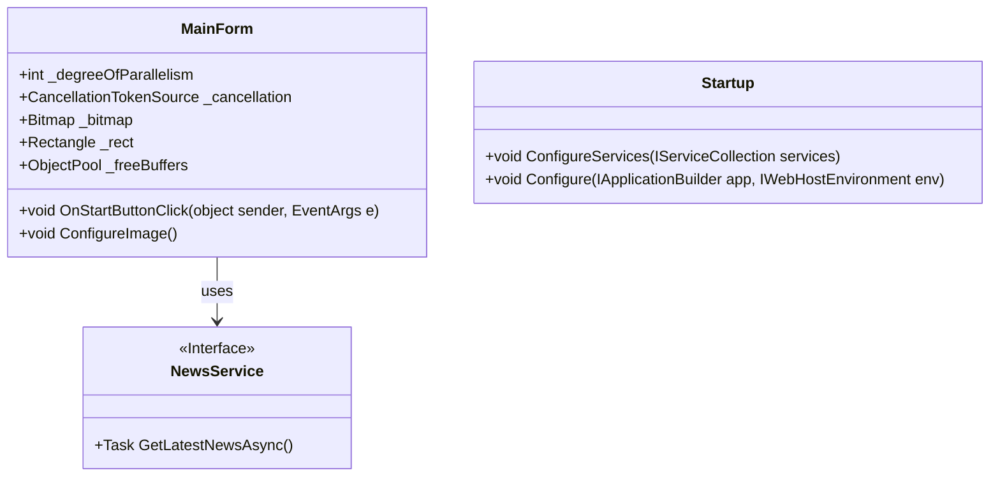

# Low Level Design Document

## 1. Component Overview
- **Name**: Raytracer Application
- **Purpose**: A graphical application for rendering images using ray tracing.
- **Responsibilities**: Handles user interactions, manages rendering tasks, and displays rendered images.

## 2. Architecture

### 2.1 Unified Class Diagram


### 2.2 Component List

#### Component: MainForm
- **Type**: Class
- **File**: csharp-sample/csharp/parallel/Raytracer/MainForm.cs
- **Description**: The main form of the application that handles user interactions and rendering.
- **Fields**:
  - `_degreeOfParallelism`: int
  - `_cancellation`: CancellationTokenSource
  - `_bitmap`: Bitmap
  - `_rect`: Rectangle
  - `_freeBuffers`: ObjectPool<int[]>
- **Constructor**: `public MainForm() => InitializeComponent();`
- **Methods**:
  - `private void OnStartButtonClick(object sender, EventArgs e)`
  - `private void ConfigureImage()`

#### Component: NewsService
- **Type**: Interface
- **File**: csharp-sample/csharp/tutorials/nullable-reference-migration/start/SimpleFeedReader/Startup.cs
- **Description**: An interface for fetching news stories.
- **Methods**:
  - `Task<NewsStory> GetLatestNewsAsync()`

#### Component: Startup
- **Type**: Class
- **File**: csharp-sample/csharp/tutorials/nullable-reference-migration/start/SimpleFeedReader/Startup.cs
- **Description**: The startup class for configuring services and middleware in the application.
- **Fields**:
  - `Configuration`: IConfiguration
- **Constructor**: `public Startup(IConfiguration configuration)`
- **Methods**:
  - `public void ConfigureServices(IServiceCollection services)`
  - `public void Configure(IApplicationBuilder app, IWebHostEnvironment env)`

## 3. Data Models
- **NewsStory**: A data model representing a news story.
  ```csharp
  public class NewsStory {
      public string Title { get; set; }
      public string Content { get; set; }
  }
  ```

## 4. Interface Definitions
```csharp
public interface INewsService {
    Task<NewsStory> GetLatestNewsAsync();
}
```

## 5. Implementation Details
- The `MainForm` class handles user interactions and manages rendering tasks.
- The `NewsService` interface is implemented by a concrete service that fetches news stories asynchronously.
- The `Startup` class configures the application's services and middleware.

## 6. Error Handling
- Errors are handled using try-catch blocks within methods where exceptions may occur.
- For example, in the `OnStartButtonClick` method, any exceptions during rendering are caught and handled gracefully.

## 7. Performance Considerations
- The application uses parallel processing to speed up rendering tasks.
- The degree of parallelism is set based on the number of processors available (`Environment.ProcessorCount`).

## 8. Security Considerations
- The application does not include explicit security measures, but it can be enhanced by implementing authentication and authorization mechanisms.

## 9. Testing Strategy
- Unit tests are written for each component to ensure they function correctly.
- Integration tests are performed to verify that components work together as expected.
- End-to-end tests are conducted to simulate user interactions and validate the application's behavior.