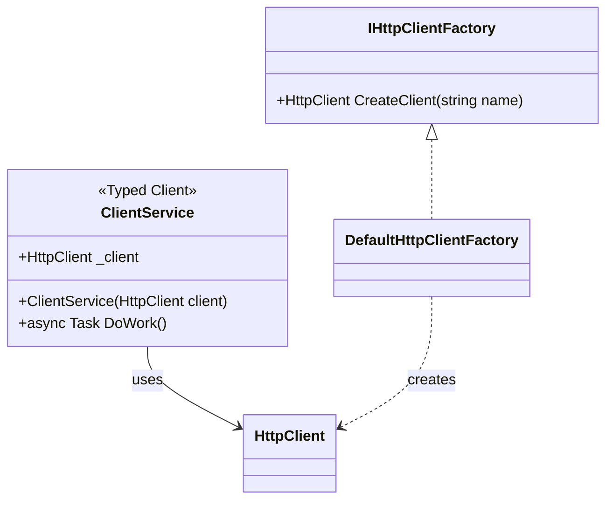

```mermaid
classDiagram
    direction TB
    class IHttpClientFactory {
        +HttpClient CreateClient(string name)
    }
    class ClientService {
        <<Typed Client>>
        +HttpClient _client
        +ClientService(HttpClient client)
        +async Task DoWork()
    }
    class DefaultHttpClientFactory

    ClientService --> HttpClient : uses
    IHttpClientFactory <|.. DefaultHttpClientFactory
    DefaultHttpClientFactory ..> HttpClient : creates
```