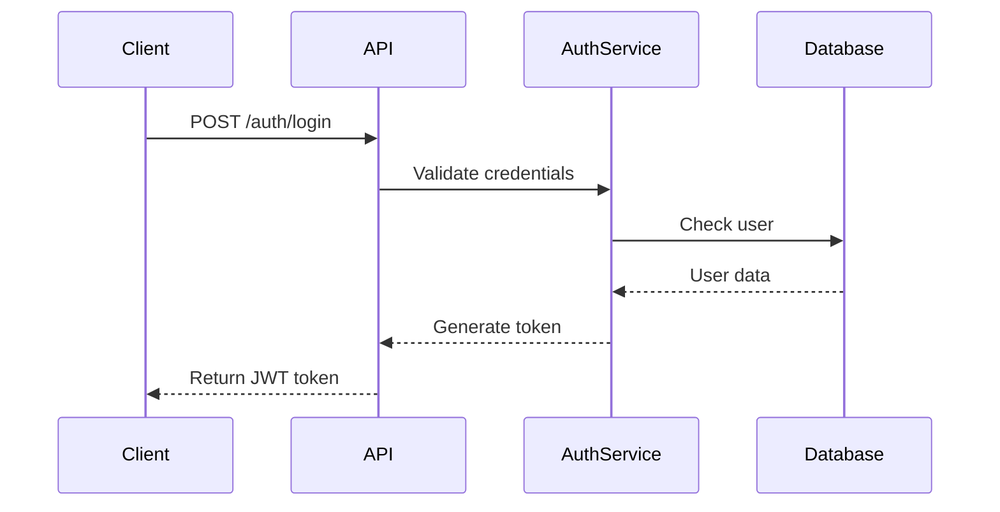
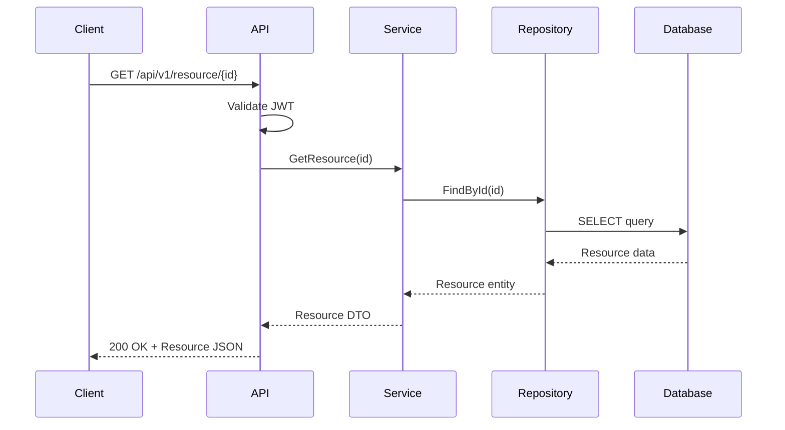

# API Workflow Documentation Template

## 1. API Inventory

### 1.1 Endpoints List
| Method | Endpoint | Description | Auth Required |
|--------|----------|-------------|---------------|
| GET    | /api/v1/resource | Get all resources | Yes |
| POST   | /api/v1/resource | Create resource | Yes |

## 2. Authentication Flow



## 3. Request/Response Flow

### 3.1 GET Resource Flow


## 4. Error Handling Patterns

### 4.1 Standard Error Response
```json
{
    "error": {
        "code": "RESOURCE_NOT_FOUND",
        "message": "The requested resource was not found",
        "timestamp": "2025-01-15T10:30:00Z",
        "path": "/api/v1/resource/123"
    }
}
```

## 5. Integration Points

### 5.1 External Services
- **Service Name**: [Purpose]
  - Endpoint: [URL]
  - Authentication: [Method] 