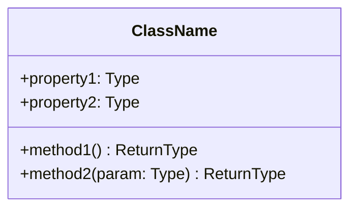

# Low Level Design Template

## 1. Component Overview
- **Name**: [Component Name]
- **Purpose**: [Brief description]
- **Responsibilities**: [List key responsibilities]

## 2. Architecture

### 2.1 Class Diagram


### 2.2 Component Dependencies
- External Dependencies:
  - [Library/Package Name]
- Internal Dependencies:
  - [Other Component Names]

## 3. Data Models

### 3.1 Entity Definitions
```csharp
public class EntityName
{
    public int Id { get; set; }
    public string Property { get; set; }
}
```

## 4. Interface Definitions

### 4.1 Public Interfaces
```csharp
public interface IServiceName
{
    Task<Result> MethodName(Parameter param);
}
```

## 5. Implementation Details

### 5.1 Key Algorithms
[Describe any complex algorithms]

### 5.2 Design Patterns Used
- [Pattern Name]: [How it's applied]

## 6. Error Handling

### 6.1 Exception Types
- `CustomException`: [When thrown]

### 6.2 Error Recovery Strategies
[Describe strategies]

## 7. Performance Considerations

### 7.1 Caching Strategy
[If applicable]

### 7.2 Optimization Techniques
[List techniques]

## 8. Security Considerations

### 8.1 Authentication
[Describe approach]

### 8.2 Authorization
[Describe approach]

## 9. Testing Strategy

### 9.1 Unit Tests
[Key test scenarios]

### 9.2 Integration Tests
[Integration points to test] 